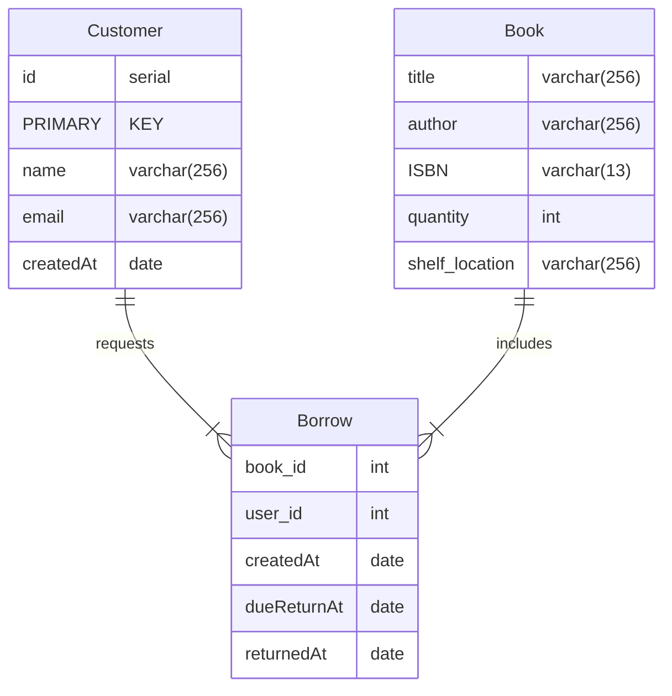

```mermaid
erDiagram
    Book {
        title varchar(256)
        author varchar(256)
        ISBN varchar(13)
        quantity int
        shelf_location varchar(256)
    }
Customer {
	id serial PRIMARY KEY
	name 			varchar(256)
	email 			varchar(256)
	createdAt 		date
}
Borrow {
	book_id 		int
	user_id 		int
	createdAt 		date
	dueReturnAt 	date
	returnedAt 		date
}

Customer ||--|{ Borrow : requests
Book ||--|{ Borrow : includes
```
